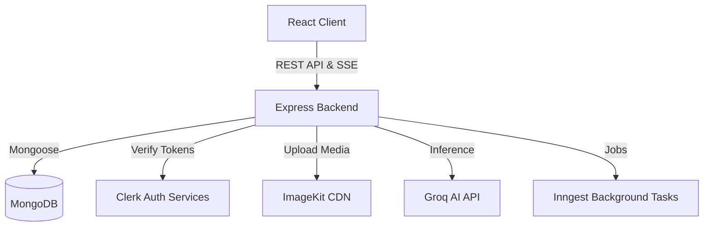
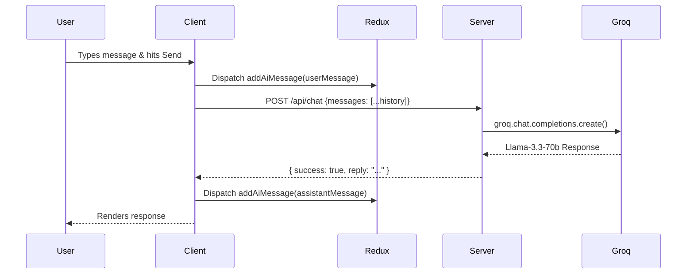

# Bolt Social

**A modern, real-time social media platform with a premium glassmorphism aesthetic and a built-in AI Assistant.**

---

## Overview

Bolt Social is a full-stack social networking application built with the MERN stack (MongoDB, Express, React, Node.js). Designed with a focus on modern user experience, it features a cohesive "glassmorphism" design system that elegantly adapts to user-selected light and dark themes. 

The platform allows users to connect, share moments via posts and stories, chat in real-time, and get instant help from an integrated context-aware AI assistant. It leverages modern authentication via Clerk, fast media delivery via ImageKit, and background job processing with Inngest.

---

## Screenshots / Preview

<!-- Placeholder for Screenshots -->
* [Landing Page / Feed Screenshot Here]
* [Profile Page Screenshot Here]
* [AI Assistant Chat Interface Screenshot Here]
* [Dark/Light Mode Comparison Screenshot Here]

---

## Features

### Core Features
* **Feed & Discover**: Scroll through a curated feed of posts and stories from connections or discover new users.
* **Profiles**: Customizable user profiles featuring cover photos, avatars, bios, and a tabbed view for Posts, Media, and Likes.
* **Connections**: Follow/unfollow users and manage your social network.
* **Real-Time Messaging**: Chat seamlessly with friends. The app uses Server-Sent Events (SSE) for instant message delivery without manual refreshing.
* **Media Sharing**: Upload images seamlessly when creating posts or sending messages.

### AI Features
* **Integrated AI Assistant**: A built-in AI companion powered by Groq's Llama-3.3-70b model.
* **Contextual Memory**: The assistant remembers the conversation context natively within the user's active session.
* **Dedicated UI**: The AI chat perfectly matches the peer-to-peer chat interface, complete with loading states and auto-scrolling.

### User Experience Features
* **Glassmorphism Design System**: A premium UI featuring layered translucent surfaces, frosted blur effects, and subtle animated background gradients.
* **Light & Dark Mode**: Persistent theme toggling that automatically respects system preferences or user overrides, stored in `localStorage`.
* **Responsive Layout**: A fully responsive application shell that seamlessly transitions from a sidebar-based desktop view to a mobile drawer layout with backdrop overlays.

### Security & Background Features
* **Secure Authentication**: Passwordless or password-based authentication handled securely via Clerk.
* **Background Processing**: Asynchronous tasks managed efficiently using Inngest (e.g., sending notification emails via Nodemailer).

---

## Tech Stack

| Category | Technologies |
| :--- | :--- |
| **Frontend** | React 19, Vite, React Router DOM, Tailwind CSS v4 |
| **State Management** | Redux Toolkit (`user`, `connections`, `messages`, `aiChat`) |
| **Backend** | Node.js, Express.js |
| **Database** | MongoDB with Mongoose ODM |
| **Authentication** | Clerk (`@clerk/clerk-react`, `@clerk/express`) |
| **AI Services** | Groq SDK (`llama-3.3-70b-versatile`) |
| **Media/Uploads** | ImageKit, Multer |
| **Background Jobs** | Inngest, Nodemailer |
| **Icons & Utilities** | Lucide React, Axios, React Hot Toast, Moment.js |

---

## Architecture

The application follows a standard MERN stack architecture with a decoupled client and server.

* **Frontend**: A React SPA built with Vite. It manages global state via Redux and routing via React Router. The UI communicates with the backend via RESTful APIs using Axios and listens for real-time updates via SSE (`EventSource`).
* **Backend**: An Express server exposing REST APIs. It connects to a MongoDB database via Mongoose and relies on Clerk middleware for authenticating requests. 
* **Media Flow**: Files are processed using `multer` on the backend and uploaded to ImageKit for optimized global delivery.
* **AI Flow**: The client sends a history array to the backend, which acts as a secure proxy to the Groq API.

### System Architecture Diagram


### AI Chat Flow


---

## Folder Structure

```text
root/
├── Client/                   # Frontend React Application
│   ├── src/
│   │   ├── api/              # Axios configuration
│   │   ├── app/              # Redux store configuration
│   │   ├── assets/           # Static assets & logos
│   │   ├── components/       # Reusable UI components (Modals, Cards, Nav)
│   │   ├── features/         # Redux slices (user, connections, messages, aiChat)
│   │   └── pages/            # Route-level components (Feed, Profile, ChatBox)
│   ├── package.json
│   └── vite.config.js
└── server/                   # Backend Express Application
    ├── Configs/              # DB connection setups
    ├── controllers/          # Route logic handlers
    ├── inngest/              # Background job definitions
    ├── middlewares/          # Auth and upload middlewares
    ├── models/               # Mongoose schemas
    ├── routes/               # Express routers (user, post, story, message, chat)
    ├── package.json
    └── server.js             # Main server entry point
```

---

## API Documentation

The backend organizes routes into logical modules. All protected routes require a valid Bearer token provided by Clerk.

| Method | Endpoint | Description | Auth Required |
| :--- | :--- | :--- | :---: |
| `POST` | `/api/user/profiles` | Fetch a user's profile and posts. | Yes |
| `POST` | `/api/message/send` | Send a direct message to a user (supports media). | Yes |
| `POST` | `/api/message/get` | Fetch conversation history with a specific user. | Yes |
| `POST` | `/api/chat` | Send a message array to the AI Assistant. | No/Optional |
| `GET/POST`| `/api/post/*` | Endpoints for feed generation and post creation. | Yes |
| `GET/POST`| `/api/story/*` | Endpoints for fetching and creating stories. | Yes |
| `GET` | `/api/message/:userId` | Server-Sent Events (SSE) endpoint for real-time incoming messages. | Yes |
| `ANY` | `/api/inngest` | Webhook endpoint for Inngest background tasks. | N/A |

*(Note: Exact payload schemas can be inspected in the respective controller files).*

---

## Environment Variables

For the application to run successfully, both the client and server require environment variables.

### Backend (`server/.env`)
| Variable | Description |
| -------- | ----------- |
| `PORT` | The port the server runs on (default: 4000). |
| `MONGODB_URI` | Connection string for your MongoDB database. |
| `CLERK_SECRET_KEY`| Secret key for Clerk authentication. |
| `GROQ_API_KEY` | API key for the Groq AI provider. |
| `IMAGEKIT_PUBLIC_KEY`| Public key for ImageKit integration. |
| `IMAGEKIT_PRIVATE_KEY`| Private key for ImageKit integration. |
| `IMAGEKIT_URL_ENDPOINT`| Base URL endpoint for ImageKit. |

### Frontend (`Client/.env`)
| Variable | Description |
| -------- | ----------- |
| `VITE_CLERK_PUBLISHABLE_KEY`| Public key for Clerk authentication. |
| `VITE_BASEURL` | The URL of the backend server (e.g., `http://localhost:4000`). |

---

## Installation & Setup

### Prerequisites
* Node.js (v18+ recommended)
* MongoDB database (Local or Atlas)
* Clerk account
* Groq Console account (for AI API key)
* ImageKit account

### 1. Clone the Repository
```bash
git clone <repository_url>
cd <repository_directory>
```

### 2. Backend Setup
```bash
cd server
npm install
```
* Create a `.env` file in the `server` directory and populate it with the required variables listed above.

### 3. Frontend Setup
```bash
cd ../Client
npm install
```
* Create a `.env` file in the `Client` directory and populate it.

### 4. Running in Development
You will need two terminal windows to run the application locally.

**Terminal 1 (Backend):**
```bash
cd server
npm run server
```

**Terminal 2 (Frontend):**
```bash
cd Client
npm run dev
```
The application will be accessible at `http://localhost:5173`.

---

## Styling and UI System

Bolt Social utilizes a custom-built **Glassmorphism Theme System** built entirely with Tailwind CSS v4 utility classes. 

**Design Philosophy:**
*   **Translucent Layers:** Uses highly transparent background colors (`bg-white/60` in light mode, `bg-white/5` in dark mode) to simulate frosted glass.
*   **Backdrop Blurs:** Extensive use of `backdrop-blur-xl` to distort the vibrant animated gradients residing in the application shell.
*   **Subtle Borders & Shadows:** Borders (`border-white/40`) and soft shadows (`shadow-xl shadow-slate-200/50`) give the glass elements physical depth and separation.
*   **Persistent Themes:** The user's preference is saved to `localStorage` and initialized globally in `App.jsx` upon mounting, preventing theme flashing.

---

## Performance Optimizations

*   **Real-time SSE:** Uses Server-Sent Events instead of aggressive polling or heavy WebSockets for lightweight, real-time message delivery.
*   **Lazy DB Connections:** The backend establishes a database connection on the *first request* rather than at boot, optimizing it for cold starts in serverless deployment environments like Vercel.
*   **Optimistic UI Updates:** Redux state is updated immediately when a message is sent to the AI or a user, providing a snappy experience while the network request resolves in the background.
*   **Media Optimization:** All image uploads are handled through ImageKit, which automatically compresses and delivers media via a global CDN.

---

## Deployment

The application is configured for easy deployment on platforms like Vercel.

*   The frontend can be deployed as a standard Vite application.
*   The backend contains a `vercel.json` file indicating it is configured to run as Serverless Functions on Vercel. Ensure all environment variables are added to your hosting provider's dashboard.

---

## Future Improvements

*   **Typing Indicators:** Add typing indicators to the real-time messaging system via an active WebSocket or ephemeral SSE state.
*   **AI Context Enhancements:** Allow the Groq AI to read the user's feed or profile data to provide highly personalized responses.
*   **Group Chats:** Expand the 1-on-1 messaging architecture to support multi-user group threads.

---

> No license file was detected in this repository.
